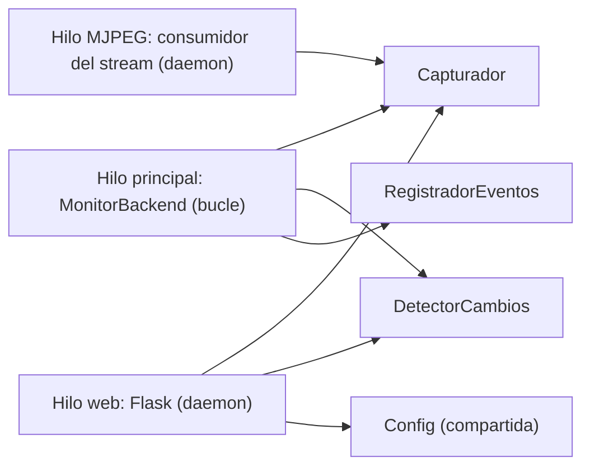
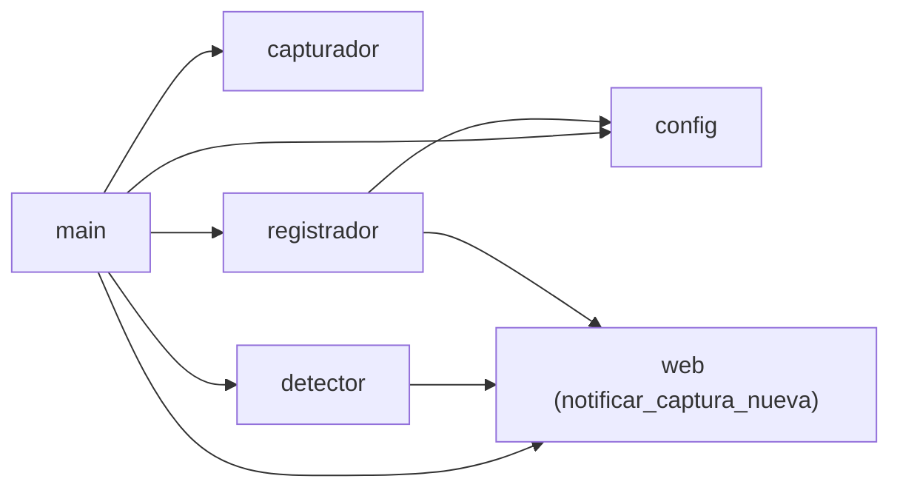

# Arquitectura del Backend Detector de Cambios

Documento técnico: cómo está construido el proyecto, cómo se comunican el
frontend y el backend, y cómo se extiende. Para la guía de uso ver `README.md`.

## 1. Visión general

**Monolito en un solo proceso Python.** No hay frontend separado: el panel web
es un HTML+JS embebido en `backend/web.py` que Flask sirve junto con una API
REST/SSE mínima.

Tres hilos conviven en el proceso:



- **Hilo principal**: el bucle `capturar → detectar → registrar`.
- **Hilo web** (daemon): Flask con el panel y la API.
- **Hilo del capturador MJPEG** (daemon): solo existe con fuentes HTTP MJPEG;
  consume el stream en segundo plano y conserva el frame más reciente.

> Los hilos comparten **el mismo objeto `DetectorCambios`**, **el mismo
> `Config`** y **el mismo capturador**. La web actualiza parámetros en caliente
> mutando esos objetos; el monitor los lee en cada ciclo. Las lecturas/escrituras
> simples de atributos son atómicas bajo el GIL de CPython, suficiente para este
> caso (no hay estados compuestos a proteger).

## 2. Módulos

| Módulo | Responsabilidad |
|---|---|
| `main.py` | `MonitorBackend`: bucle principal, logging, arranca la web en un hilo daemon, resumen al detener |
| `backend/config.py` | `Config` (dataclass): carga de `config.yaml`, serialización (`a_dict`/`guardar`) para persistir cambios desde la web |
| `backend/capturador.py` | Fuentes de imagen: `CapturadorPantalla` (mss), `CapturadorCamara` (OpenCV USB/RTSP con reconexión), `CapturadorMJPEG` (hilo + frame más reciente). Factory `crear_capturador(config)` |
| `backend/detector.py` | `DetectorCambios`: pipeline por frame (ROI → blur → alinear → diff/ssim/mse → umbral → área → estabilidad). Referencia estable. `actualizar()` para cambios en caliente |
| `backend/web.py` | Panel web (HTML+JS embebido) + API REST/SSE. Persistencia del ROI (`roi.json`) y notificador SSE de capturas |
| `backend/registrador.py` | `RegistradorEventos`: escribe `eventos.jsonl` (append), guarda imágenes en `capturas_cambio/`, aplica `max_imagenes`, notifica al panel (SSE) |

Dependencias entre módulos:



> Nota de acoplamiento: `detector.py` y `registrador.py` importan funciones de
> `web.py` (`cargar_roi`, `notificar_captura_nueva`). Funciona porque `web.py`
> no importa esos módulos a nivel de módulo (los recibe por parámetro en
> `crear_app`). Ver "Deudas técnicas" §8.

## 3. El bucle del monitor (`main.py`)

```
while True:
    imagen = capturador.capturar()          # siempre el frame más reciente
    resultado = detector.procesar(imagen)   # pipeline completo
    if resultado["hubo_cambio"]:
        if pasó min_intervalo_eventos:
            registrador.registrar(evento)   # imagen + JSONL + aviso SSE
    esperar hasta completar intervalo_segundos
```

## 4. Flujo de datos

### Ruta de detección (por frame)

```
cámara → CapturadorMJPEG (hilo) → capturar() → DetectorCambios.procesar()
  → ROI (roi.json, recargado en cada llamada)
  → blur en color
  → alineación (si alinear_imagenes): correlación de fase + shift + margen
  → máscara de diferencia (ssim/diff/mse) con umbral de píxel
  → excluir borde + decidir por área (min_area_px)
  → filtro temporal (frames_estables)
  → RegistradorEventos.registrar()  (solo si cambio confirmado)
  → notificar_captura_nueva() → SSE → navegador
```

### Ruta de configuración (en vivo)

```
navegador → POST /api/config → valida → detector.actualizar(params)
  → muta Config compartida → config.guardar() → config.yaml
```

El monitor lee `config.intervalo_segundos` y `config.min_intervalo_eventos` en
cada ciclo; el detector usa sus propios atributos (actualizados por la web).
Por eso los cambios se aplican **sin reiniciar**.

### Ruta del ROI

```
canvas (mouse) → POST /api/roi → roi.json → el detector recarga el archivo
  en cada procesar() (cargar_roi) → se aplica al siguiente frame
```

### Ruta de la UI (sin polling)

```
GET /                → HTML+JS embebido (PAGINA)
GET /video           → MJPEG en vivo (con ROI dibujado sobre una COPIA del frame)
GET /api/ultimas     → últimas 2 capturas (bajo demanda al cargar)
GET /api/log         → eventos + sugerencias de ajuste (bajo demanda)
GET /api/eventos     → SSE: avisa cuando hay captura nueva (actualiza la UI)
GET /api/estado      → SSE: desplazamiento estimado + margen + interior/borde
GET/POST/DELETE /api/roi
GET/POST /api/config
DELETE /api/log      → limpia eventos.jsonl
GET /capturas/<nombre> → sirve una imagen (protegido contra rutas fuera de la carpeta)
```

## 5. Contrato de la API

| Endpoint | Método | Entrada | Salida |
|---|---|---|---|
| `/api/roi` | GET | — | `{"region": [x,y,w,h] \| null}` |
| `/api/roi` | POST | `{"region":[x,y,w,h]}` | `{"ok":true}` |
| `/api/roi` | DELETE | — | `{"ok":true}` |
| `/api/ultimas` | GET | — | `{"capturas":[{archivo,url,fecha},...]}` |
| `/api/log` | GET | — | `{"min_area_px":N, "eventos":[...]}` con sugerencias |
| `/api/log` | DELETE | — | `{"ok":true}` (vacía el JSONL) |
| `/api/config` | GET | — | parámetros completos (`config.a_dict()`) + `presets` + `camara_resolucion` |
| `/api/config` | POST | `{"captura":{...},"deteccion":{...}}` (parcial) | `{"ok":true}` · `400` valor inválido · `502` si la cámara nueva no abre |
| `/api/estado-sistema` | GET | — | estado completo (solo lectura): `{config, runtime{camara_viva, camara_resolucion, preset_aplicado, rotacion_efectiva, roi, ia_activa, capturas, cambios}}` |
| `/api/rotacion` | POST | `{"rotacion": 0\|90\|180\|270}` | `{"ok":true,"rotacion":N}` |
| `/api/eventos` | GET | — | SSE: `data: <contador>` cuando hay captura nueva |
| `/api/config-eventos` | GET | — | SSE: avisa cuando la CONFIGURACIÓN cambió (panel o cliente externo) |
| `/api/estado` | GET | — | SSE (cada ~1 s): `{"alinear":bool, "dy", "dx", "activo", "margen", "area_interior", "area_borde"}` |
| `/video` | GET | — | MJPEG multipart (**solo panel interno; NO forma parte de la API pública**) |
| `/capturas/<nombre>` | GET | — | PNG del evento (**solo panel interno; NO forma parte de la API pública**) |

El frontend usa `EventSource` para `/api/eventos`, `/api/config-eventos` y
`/api/estado` (notificación push) y `fetch` para el resto. **No hay polling**:
las capturas y la configuración se actualizan solo cuando el servidor avisa.

### API pública de configuración (para clientes externos)

La API de configuración/estado (solo JSON) es consumible desde otro equipo de
la red. **No expone imagen de cámara**: `/video` y `/capturas/*` son del panel
interno.

- **Consultar parámetros**: `GET /api/config` (o `GET /api/estado-sistema`
  para incluir el estado de runtime).
- **Sobrescribir parámetros**: `POST /api/config` con un subconjunto parcial.
  Acepta **todos** los parámetros de captura (`intervalo_segundos`,
  `rotacion`, `reconectar_segundos`, `nombre_camara`) y de detección.
- **Cambiar la cámara**: incluir `camara_fuente` (y opcionalmente `fuente`)
  recrea el capturador **en vivo** (sin reiniciar el proceso). Si la cámara
  nueva no abre, se mantiene la anterior y responde `502`.
- **Sincronización**: todo cambio dispara el SSE `/api/config-eventos`, que el
  panel escucha para reflejar los cambios externos automáticamente (sin
  recargar la página).

Ejemplo de inyección desde otro equipo:

```bash
curl -X POST http://IP-DEL-SERVIDOR:5000/api/config \
  -H "Content-Type: application/json" \
  -d '{"camara_fuente": "http://192.168.1.50:8080/video", "captura": {"rotacion": 90, "intervalo_segundos": 1.0}}'
```

> Sin autenticación en esta PoC: cualquier equipo de la red local puede leer y
> escribir la configuración. No exponer fuera de la red local.

## 6. Persistencia

| Archivo | Escritor | Formato | Notas |
|---|---|---|---|
| `config.yaml` | web (`config.guardar`) | YAML | Se **regenera completo** al guardar desde la web (se pierden comentarios manuales) |
| `eventos.jsonl` | registrador | JSON por línea (append) | Toda la historia; la web lee las últimas 30 líneas |
| `capturas_cambio/` | registrador | PNG con timestamp en el nombre | Límite `max_imagenes` (elimina las más antiguas por orden de nombre) |
| `roi.json` | web | JSON | Se recarga en cada frame |

Todos ignorados por git (ver `.gitignore`).

## 7. Decisiones de diseño clave

1. **Capturador MJPEG con hilo propio**: OpenCV lee los streams MJPEG
   acumulando frames en un buffer interno (retraso de segundos). Este
   capturador consume el stream en un hilo y conserva **solo el último frame**,
   por lo que `capturar()` devuelve al instante el frame más fresco → la
   detección responde en milisegundos.
2. **El ROI se dibuja sobre una copia del frame** (`frame.copy()` en
   `generar_video`): dibujar el rectángulo sobre el frame compartido
   **contaminaba lo que analizaba el detector** (fue la causa histórica de
   falsos positivos de ~1150 px).
3. **Detección en color, no en gris**: un LED rojo sobre fondo oscuro puede
   tener el mismo valor de gris que el fondo; comparando los 3 canales no se
   pierde esa información.
4. **Referencia estable**: se compara contra la última imagen confirmada sin
   cambio (no contra el frame anterior). Se actualiza solo cuando no hay cambio
   o cuando un cambio se confirma — así un parpadeo no envenena la referencia.
5. **La vibración se compensa ANTES de comparar** (correlación de fase +
   shift), y el **borde** rellenado por el shift se **excluye** de la decisión
   (`margen`) y se reporta aparte (`area_borde`).
6. **`umbral` (0-1) = sensibilidad a nivel píxel** para ssim/diff (más bajo =
   más sensible) y corte de score para mse. `min_area_px` decide por área.
7. **Parámetros en vivo**: la web recibe el mismo objeto `Config` y
   `DetectorCambios` que el monitor; los muta y los persiste. El detector
   expone `actualizar()` para validar y aplicar cambios de detección.
8. **Panel compartido**: el HTML/JS del panel vive en `compartido/panel.html`
   (un solo archivo). Lo sirve el **concentrador**; el worker ya no sirve HTML.

## 8. Deudas técnicas / posibles refactors

- **`cargar_roi` vive en `web.py` pero lo usa el detector** → moverlo a un
  módulo compartido (p. ej. `backend/roi.py`) para invertir la dependencia.
- **Servidor de desarrollo de Flask** (`app.run`): suficiente para 1-2 clientes
  y 1 fps; para producción usar `waitress` (Windows) o `gunicorn` detrás de
  un proxy. El worker usa `threaded=True` porque el panel abre varias
  conexiones SSE simultáneas.
- **Límite de conexiones del navegador**: el panel abre 4 SSE permanentes +
  el video MJPEG. Con HTTP/1.1 el navegador permite 6 por host:puerto, así que
  en el concentrador quedan casi agotadas. Si aparecen bloqueos, el video puede
  servirse directo desde el worker (host distinto → contador propio).
- **Eventos en memoria** (`leer_log_eventos` lee el archivo completo): con
  millones de líneas convendrá un índice o base de datos ligera (SQLite).
- **Multi-cámara**: hoy es un proceso por cámara (puertos distintos), unificados
  en un solo panel por el concentrador.

## 9. Cómo extender

1. **IA bajo demanda**: en `main.py`, dentro del bloque `if hubo_cambio`,
   llamar al servicio de visión con `resultado["imagen_analizada"]` y guardar
   el resultado en el JSONL. Ya está previsto en la sección `ia:` del YAML.
2. **Verificación anti-oculsión** (pendiente de implementar): al confirmar un
   cambio, esperar ~1 s y recapturar; comparar el estado estabilizado contra la
   referencia anterior para descartar "algo que se cruzó" (el diseño está
   documentado en el README, sección Camino a producción).
3. **API externa**: agregar rutas FastAPI/Flask sobre los mismos objetos
   (consultar eventos, redefinir ROI, ajustar config).
4. **Shutter rápido en producción**: la vibración física durante la exposición
   causa desenfoque de movimiento que la alineación **no** puede corregir; se
   mitiga con exposición corta en la cámara y montaje amortiguado.
